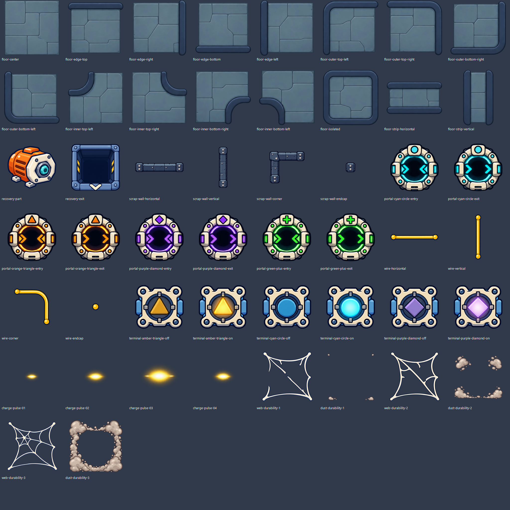

# 게임 화면 1순위 이미지 v1

2026-09-30 제작. 개별 투명 PNG 50장과 용도별 시트 9장.

## 구성

| 종류 | 개별 이미지 | 저장 경로 (`Assets/Textures/` 기준) | 검토용 시트 |
|---|---:|---|---|
| 보드 바닥·변·안쪽/바깥쪽 모서리·독립 칸·통로 | 16 | `BoardTerrain/Floor/` | [1024×1024](floor-v1-sheet.png) |
| 회수 부품·도착 바닥 | 2 | `BoardDevices/Recovery/` | [512×512](recovery-v1-sheet.png) |
| 고철 벽 가로·세로·모서리·끝 | 4 | `BoardTerrain/Walls/` | [512×512](walls-v1-sheet.png) |
| 포털 4쌍의 입구·출구 | 8 | `BoardDevices/Portals/` | [512×1024](portals-v1-sheet.png) |
| 전선 가로·세로·모서리·끝 | 4 | `BoardDevices/Wiring/` | [512×512](wires-v1-sheet.png) |
| 연결 단자 3종의 비활성·활성 | 6 | `BoardDevices/Wiring/` | [512×1024](terminals-v1-sheet.png) |
| 충전 빛 애니메이션 | 4 | `Effects/GeneratorCharge/` | [512×512](charge-pulse-v1-sheet.png) |
| 거미줄 내구도 1·2·3 (v2) | 3 | `Obstacles/Web/` | [512×512](web-v1-sheet.png) |
| 먼지 내구도 1·2·3 | 3 | `Obstacles/Dust/` | [512×512](dust-v1-sheet.png) |

개별 이미지와 애니메이션 프레임은 모두 256×256이다. 시트는 왼쪽 위부터 가로 방향 순서이며, 남는 칸은 투명하다. 충전 빛은 1→2→3→4 순서이며 밝기와 크기가 변한다. 이동은 실제 연결 경로를 따라 게임에서 처리해야 한다. 단자는 왼쪽 비활성, 오른쪽 활성이다.

## 구분 기준

- 회수 부품은 주황색 모터 코어, 도착 바닥은 노란 표시가 있는 파인 수거구로 표현했다.
- 포털 쌍은 청록 원·주황 삼각형·보라 마름모·초록 십자로 색과 표식을 함께 구분한다. 입구는 중앙으로 모이는 화살표, 출구는 오른쪽으로 흐르는 화살표다.
- 고철 벽은 두꺼운 각진 금속, 전선은 가는 노란 곡선으로 구분한다.
- 연결 단자는 노란 삼각형·청록 원·보라 마름모의 세 종류다.
- 거미줄은 끊어진 줄에서 촘촘한 줄로, 먼지는 작은 잔여물에서 가장자리의 큰 더미로 내구도가 증가한다.

## 저장 및 적용 상태

PNG와 개별 Sprite용 `.meta`를 추가했다. 기존 이미지와 GUID는 보존했다. 시트는 검토·후속 패킹 자료로 이 문서 폴더에만 보관하며 게임에서 직접 로드하지 않는다.

후속 작업으로 레벨 에디터 편집 보드에 연결했다. 활성 칸의 바닥은 네 사분면별로 이웃 칸을 확인하여 외곽과 오목한 모서리를 표시한다. 회수 부품·도착 바닥·포털·벽·전선·단자를 표시하고, 거미줄과 먼지는 내구도별로 고른다. 포털 위 내용물은 작게 표시하여 두 역할을 함께 읽을 수 있다. 전선의 4프레임 충전 빛은 연결 방향 미리보기이며 실제 게임 상태를 변경하지 않는다.

선택 목록과 플레이 테스트 화면은 이 작업에 포함하지 않는다. 기존 Addressables 방식으로 바닥·벽·회수·포털·배선·충전 빛을 여섯 아틀라스로 분리했고 거미줄·먼지는 기존 종류별 아틀라스를 갱신한다. 개별 PNG를 직접 로드하지 않는다.

2026-09-30 적용 검증: Unity 컴파일 및 Addressables 콘텐츠 빌드 완료. 실제 번들 로드·이미지 매핑·겹침·비활성 칸·데이터 보존 336개, 드래그 연결·해제·Undo 등 기존 연결 회귀 37개가 통과했다. 이미지 로드가 끝날 때 연결점의 입력 요소를 재생성하지 않고 그림만 갱신한다.

[실제 레벨 에디터 적용 화면](editor-board.png). 검증용 메모리 레벨이며 기존 레벨 에셋은 변경하지 않았다.

원본은 built-in image_gen으로 제작했다. 알파를 유지하여 프레임 분리와 크기 조정만 수행했다. [manifest.json](manifest.json)에 개별 경로, 원본 이름, 잘라낸 영역을 기록했다.

원본 폴더: `C:/Users/ddara/.codex/generated_images/01a0ee2d-1394-75c3-ba75-9e7eaf6080f1/`.
