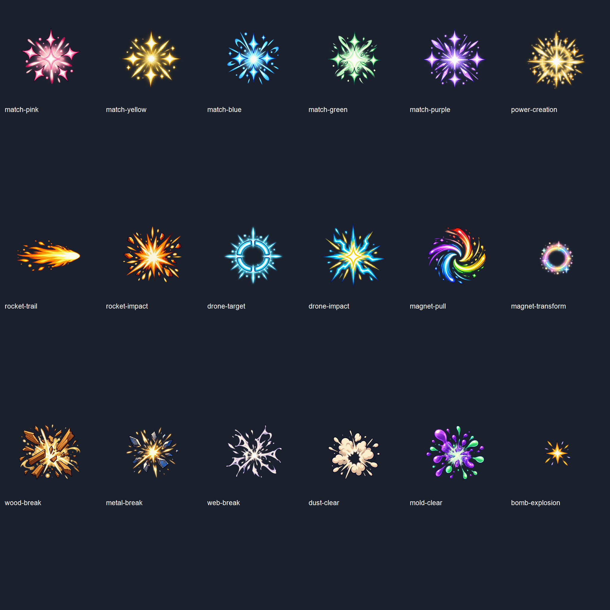

# 게임 화면 2차 효과 이미지 v1

2026-09-30. 내장 image_gen으로 생성한 투명 효과 18종, 개별 프레임 76장.

## 파일 구성

게임용 파일은 `Assets/Textures/Effects/<분류>/Animations/<이름>-frame-01-v1-256.png` 형식이다. 각 프레임은 256×256 RGBA, 중앙 피벗이며 가장자리에 8px 여백을 추가했다. 시트의 왼쪽 위부터 가로 방향으로 읽는다.

| 종류 | 이름 | 분류 | 프레임 |
|---|---|---|---:|
| 매칭 5색 | match-pink / yellow / blue / green / purple | Match | 20 |
| 파워 생성 | power-creation | PowerCreation | 4 |
| 로켓 궤적·타격 | rocket-trail / rocket-impact | Rocket | 8 |
| 드론 표적·착탄 | drone-target / drone-impact | Drone | 8 |
| 자석 흡인·변환 | magnet-pull / magnet-transform | Magnet | 8 |
| 나무 파괴 | wood-break | WoodBreak | 4 |
| 금속 파괴 | metal-break | MetalBreak | 4 |
| 거미줄 제거 | web-break | WebBreak | 4 |
| 먼지 제거 | dust-clear | DustClear | 4 |
| 곰팡이 제거 | mold-clear | MoldClear | 4 |
| 달 폭탄 폭발 | bomb-explosion | BombExplosion | 8 |

검토용 시트는 이 문서 폴더의 `<이름>-sheet-v1.png`다. 4프레임 시트 17장은 512×512, 폭탄 8프레임 시트는 1024×512, 전체 미리보기는 2048×2048이다. 모두 2의 거듭제곱 크기다.

## 적용 기준

- 로켓 궤적은 오른쪽 이동 기준이며 세로와 반대 방향은 재생 시 회전한다. 기존 로켓 본체 발사 및 드론 프로펠라 프레임은 재사용한다.
- 효과는 본체와 분리된 오버레이다. 마지막 프레임 이후 숨겨 잔상이 남지 않게 한다. 재생 속도와 크기는 실제 플레이 적용 시 조정한다.
- 11개 분류 폴더로 나눴다. 기존 `BoardAtlasPrebuild`는 `Animations` 경로를 수집하고 `Effects/<분류>`별 아틀라스로 구분하므로 다음 아틀라스 생성 때 각각 들어간다. 이번 작업에서 새 Addressables 번들 빌드나 발동 이벤트 연결은 수행하지 않았다.
- 스프라이트용 메타데이터를 포함했다. 원본 게임 에셋은 덮어쓰지 않았다.

## 검수와 생성 기록

[manifest.json](manifest.json)에 최종 선택 원본 경로, 전체 생성 프롬프트, 그리드 구성을 기록했다. 내장 이미지 생성 도구를 사용했으며 CLI/API 대체 경로는 사용하지 않았다. 원본의 알파를 유지한 채 격자를 분리하고 프레임 크기와 여백을 정규화했다. 자석 변환은 가장자리 잘림을 피하도록 작은 고리로 재생성했다.

[validation.json](validation.json)은 개별 PNG 76장의 크기, 투명 픽셀 수, 가시 픽셀 수 검사 결과다. 시트와 각 프레임을 육안으로 검토했다. 생성형 프레임이므로 실제 게임에서의 시간적 연속성·재생 속도 검수는 후속 적용 단계에 남아 있다.
